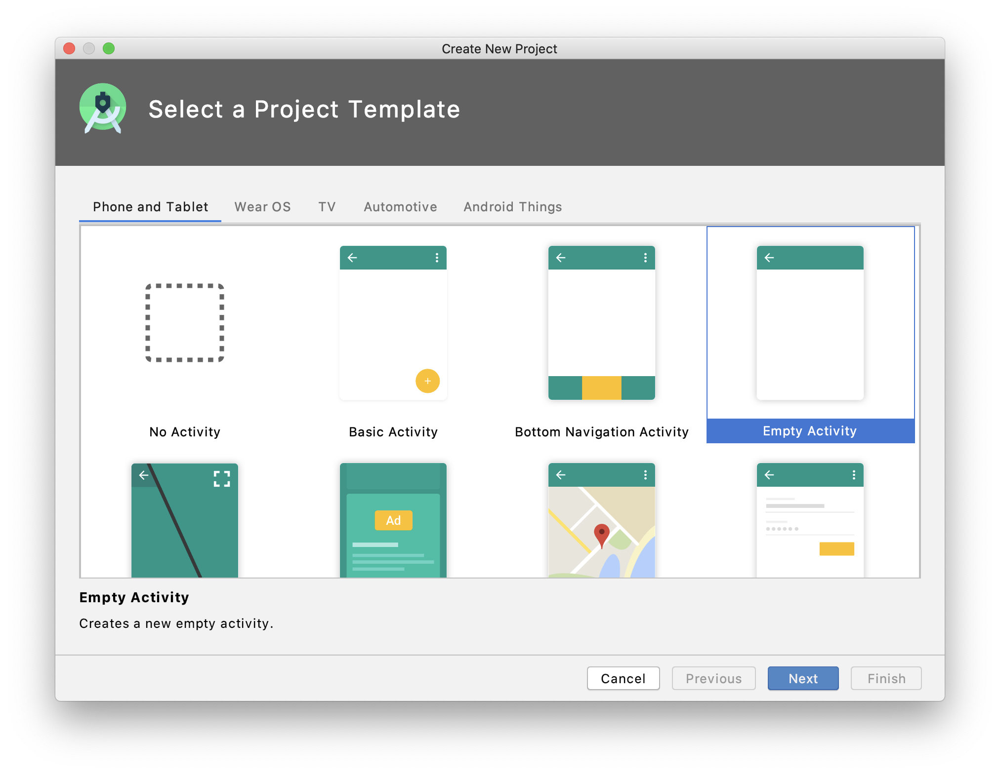
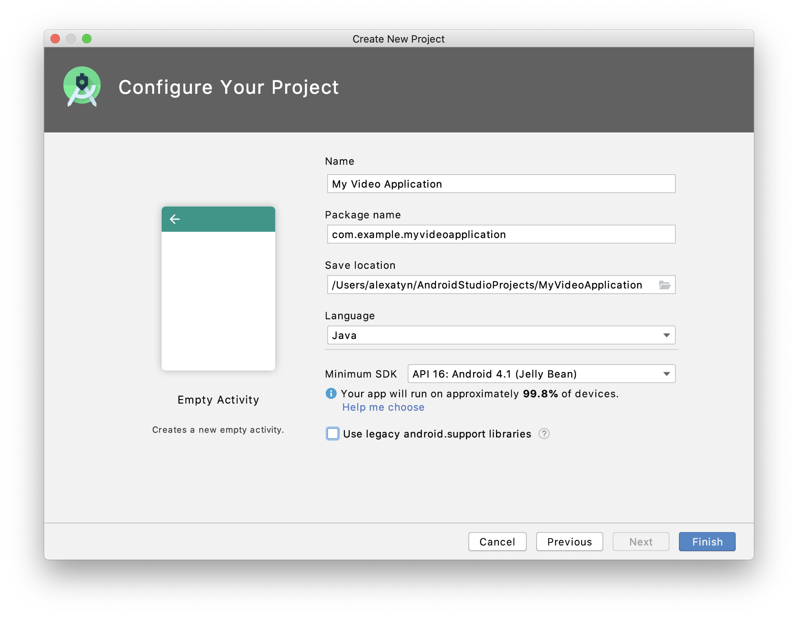
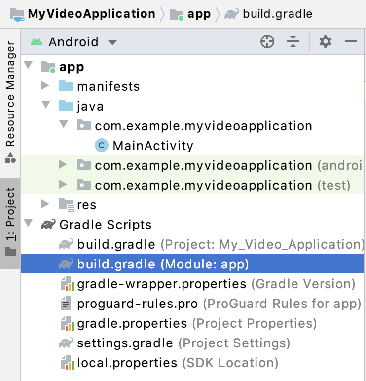

# Amplify Video for Android

Frontend library for the [Amplify Video Plugin](https://github.com/awslabs/amplify-video). 

New to AWS Amplify or Amplify Video? Consider following one of the [tutorials or getting started guides](https://github.com/awslabs/amplify-video#getting-started-with-amplify-video) first.

## Getting Started

1. Create a new Android Studio project with an **Empty Activity**.



2. Give your project a name and **finish** project creation.



3. At the top level of your project directory, initialize an Amplify project and an Amplify Video live streaming resource.
   	**Follow the [Getting Started with Live](https://github.com/awslabs/amplify-video/wiki/Getting-Started-with-Live) guide.**

4. Open the the **build.gradle** script for your new **app** module.



5. Modify the **dependencies** section to include *amplify-android*, *amplify-android-extended* and *amplify-video-android*:

```groovy
dependencies {
    // ... other depedencies ...

    implementation 'com.amplifyframework:core:1.0.0'
    implementation 'com.amplifyframework:extended:0.1.7'
    implementation 'com.amplify-video:aws-video:0.1.9'
}
```

6. Because Amplify Android uses Java 8 features, modify the **android** section to include these compile options:

```groovy
android {
    // ... other configuration ...
  
    compileOptions {
        sourceCompatibility JavaVersion.VERSION_1_8
        targetCompatibility JavaVersion.VERSION_1_8
    }
}
```

7. In the **onCreate()** method of your **MainActivity** class, initialize Amplify Extended with the Video plugin:

```java
    @Override
    protected void onCreate(Bundle savedInstanceState) {
        super.onCreate(savedInstanceState);
        setContentView(R.layout.activity_main);

        try {
            AmplifyExtended.addCategory(new VideoCategory(), new VideoCategoryConfiguration(), "amplifyvideoconfiguration");
            AmplifyExtended.addPlugin(AmplifyExtended.category("video"), new AWSVideoPlugin());
            AmplifyExtended.configure(getApplicationContext());
        } catch (AmplifyException error) {
            Log.e("MyVideoApp", "Couldn't initialize Amplify Extended.");
        }
      
    }
```

8. Add a VideoView to your app's layout. In `res/layout/activity_main.xml`, replace the `TextView` with an `AWSLiveVideoView` called **myVideoView**:

```xml
    <com.amplifyframework.video.ui.AWSLiveVideoView
        android:id="@+id/myVideoView"
        android:layout_width="wrap_content"
        android:layout_height="wrap_content"
        app:layout_constraintBottom_toBottomOf="parent"
        app:layout_constraintLeft_toLeftOf="parent"
        app:layout_constraintRight_toRightOf="parent"
        app:layout_constraintTop_toTopOf="parent" />
```

9. Add the **internet permission** to `manifests/AndroidManifest.xml`  outside the `<application>` tag:

```xml
    <uses-permission android:name="android.permission.INTERNET" />
```

10. Extend your **onCreate()** method in the **MainActivity** class to attach your new view to an Amplify Video resource.

    Replace **mylivestream** with the name you gave your new resource at Step 3. You can use `amplify status	` to list all of your project resources.

```java
        // ... code to initialize Amplify Extended ...

        AWSLiveVideoView videoView = findViewById(R.id.myVideoView);
        AWSLiveVideoPlayer player = videoView.getPlayer();
        VideoCategory amplifyVideo = AmplifyExtended.category("video");
        LiveResource videoResource = amplifyVideo.getLiveResource("mylivestream");
        player.attach(videoResource);
        player.play();
```

11. If you haven't already, begin streaming to the **MediaLive ingest URL** provided by Amplify Video.

    The URL can be viewed again by using `amplify video get-info`.

12. Launch your app and view the live stream.

## Going Further

### Handling Events

To be notified about player events, implement the `VideoPlayer.Listener` interface and register your listener:

```java
    player.addListener(myListener);
```

Supported events:

- [x] State Change (to any of Idle, Preparing, Ready, Playing, Buffering, Ended)
- [x] Preparing
- [x] Ready
- [x] Seek
- [x] Play
- [x] Pause
- [x] Buffering Start
- [x] Buffering Complete
- [x] Playback End
- [x] Screen Touch


### Adding Analytics

To enable sending analytics events to AWS Pinpoint, you must add the analytics category to your project.

1. From your project's root directory, use the Amplify CLI tool to add analytics.

```bash
$ amplify add analytics
```

2. Accept the default prompts and provision the AWS resources.

```bash
$ amplify push
```

3. Modify the initialization of Amplify Extended in your **MainActivity** class to also initialize Amplify with the analytics and auth categories.

```java
        try {
            AmplifyExtended.addCategory(new VideoCategory(), new VideoCategoryConfiguration(), "amplifyvideoconfiguration");
            AmplifyExtended.addPlugin(AmplifyExtended.category("video"), new AWSVideoPlugin());
            AmplifyExtended.configure(getApplicationContext());
          
            Amplify.addPlugin(new AWSCognitoAuthPlugin());
            Amplify.addPlugin(new AWSPinpointAnalyticsPlugin(new Application()));
            Amplify.configure(getApplicationContext());
        } catch (AmplifyException error) {
            Log.e("MyVideoApp", "Couldn't initialize Amplify and Amplify Extended.");
        }
```

4. Provide a copy of your analytics category to the Amplify Video player at any time to enable all default analytics:

```java
        player.addAnalytics(Amplify.Analytics);
```


#### Using a Custom Video View

Any class that extends `VideoView` can be used to display Amplify Video streams (even `VideoView` itself).

1. Instead of adding an `AWSLiveVideoView` to your `res/layout/activity_main.xml` file, replace it with a `VideoView`.

```xml
    <VideoView
        android:id="@+id/myVideoView"
        android:layout_width="wrap_content"
        android:layout_height="wrap_content"
        app:layout_constraintBottom_toBottomOf="parent"
        app:layout_constraintLeft_toLeftOf="parent"
        app:layout_constraintRight_toRightOf="parent"
        app:layout_constraintTop_toTopOf="parent" />
```

2. Instead of the code from Step 10 in [Getting Started](#getting-started) above, attach the player to your view like this:

```java
        // ... code to initialize Amplify Extended ...

        AWSLiveVideoView videoView = findViewById(R.id.myVideoView);
        AWSLiveVideoPlayer player = new AWSLiveVideoPlayer(videoView); // <-- different
        VideoCategory amplifyVideo = AmplifyExtended.category("video");
        LiveResource videoResource = amplifyVideo.getLiveResource("mylivestream");
        player.attach(videoResource);
        player.play();
```


## License

This library is licensed under the [Apache 2.0 License](./LICENSE).

## Report a Bug

We appreciate your feedback -- comments, questions, and bug reports. Please [submit a GitHub issue](/issues).

## Contribute to the Project

Please see the [Contributing Guidelines](./CONTRIBUTING.md).
